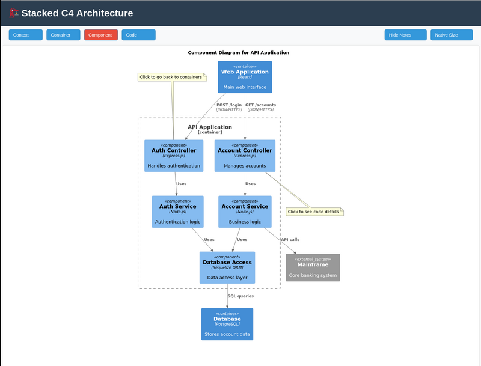

# Stacked C4 SVG

Generate self-contained, navigable C4 architecture diagrams from PlantUML with embedded JavaScript navigation.

[](docs/demo.png)

## Features

- **Self-contained**: Single SVG file with all diagrams and navigation
- **Clickable navigation**: Click diagram elements to drill down between C4 levels
- **Flexible diagram count**: Supports 3 or 4 C4 levels (code level optional)

## Quick Start

1. **Create your PlantUML C4 diagrams** with numbered prefixes:
   ```
   01-context.puml
   02-container.puml
   03-component.puml
   04-code.puml (optional)
   ```

2. **Generate the stacked SVG**:
   ```bash
   ./manage.sh generate <directory> > output.svg

   # With custom title
   ./manage.sh generate <directory> --title "My System" > output.svg

   # With output file
   ./svg-stacker <directory> --output output.svg --title "My System"
   ```

3. **View the result**: Open the generated SVG in your browser

## Generating C4 Diagrams with AI

You can use Claude or other AI assistants to generate PlantUML C4 diagrams. Here's an effective prompt:

```
Please create a complete set of C4 diagrams for [your system name] using PlantUML.

Requirements:
- Create 3-4 diagram files: 01-context.puml, 02-container.puml, 03-component.puml, and optionally 04-code.puml
- Use the PlantUML C4 model (!include <C4/C4_Context>, etc.)
- Add $link parameters to elements for drill-down navigation:
  - Context level: $link="02-container.svg"
  - Container level: $link="03-component.svg"
  - Component level: $link="04-code.svg" (if applicable)
- Include descriptive notes to help guide attention

The system architecture:
[Describe your system, its components, technologies, and relationships or tell AI to inspect your project directory]
```

The AI will generate numbered .puml files ready to use with this tool.

## How It Works

1. Detects `.puml` files and generates SVGs via PlantUML in temp directory
2. Extracts SVG content and validates XML structure
3. Processes PlantUML `$link` elements and converts to JavaScript onclick handlers
4. Creates layered SVG with embedded navigation controls
5. Pretty-prints embedded SVG content for readability
6. Produces single self-contained file ready for sharing

## Requirements

- Go compiler for building the generator
- PlantUML installed and available in PATH
- PlantUML C4 library for diagram generation

## Usage

### Using manage.sh (recommended)

```bash
# Build
./manage.sh build

# Test
./manage.sh test

# Generate with default title
./manage.sh generate examples/ > example.svg

# Generate with custom title
./manage.sh generate examples/ --title "My Architecture" > example.svg

# Generate to file with title
./manage.sh generate examples/ --output output.svg --title "My System"
```

### Using svg-stacker directly

```bash
# Output to stdout
./svg-stacker <directory> > output.svg

# Output to file
./svg-stacker <directory> --output output.svg

# With custom title
./svg-stacker <directory> --output output.svg --title "My System"
```

## PlantUML File Naming

Files must be numbered 01-04 with the following convention:
- `01-*.puml` - Context diagram (required)
- `02-*.puml` - Container diagram (required)
- `03-*.puml` - Component diagram (required)
- `04-*.puml` - Code diagram (optional)

Example: `01-context.puml`, `02-container.puml`, `03-component.puml`, `04-code.puml`

## Adding Clickable Navigation

To enable drill-down navigation, add `$link` parameter to your PlantUML elements:

```plantuml
System(my_system, "My System", "Description", $link="02-container.svg")
Container(my_container, "Container", "Tech", "Description", $link="03-component.svg")
Component(my_component, "Component", "Description", $link="04-code.svg")
```

The link filenames don't matter - they're replaced with JavaScript navigation.

## Project Structure

- `examples/` - Example PlantUML source files (.puml)
- `main.go` - Go generator source code
- `navigation.js` - JavaScript navigation logic (embedded into final SVG)
- `manage.sh` - Build and generate script
- `svg-stacker` - Compiled Go binary (gitignored)
- `CLAUDE.md` - Development guidance for Claude Code

